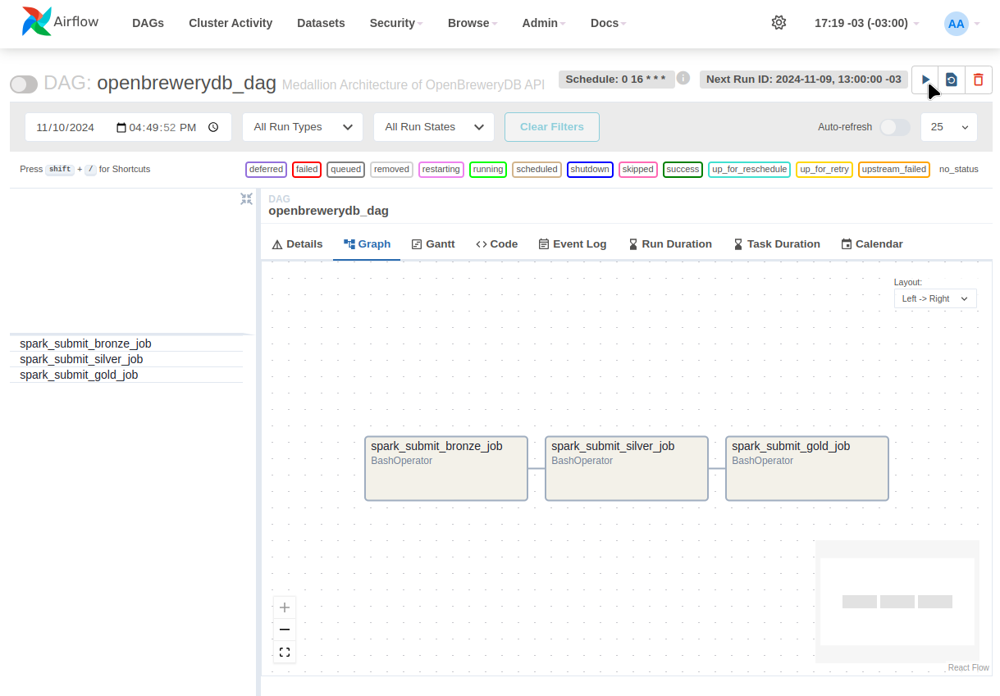
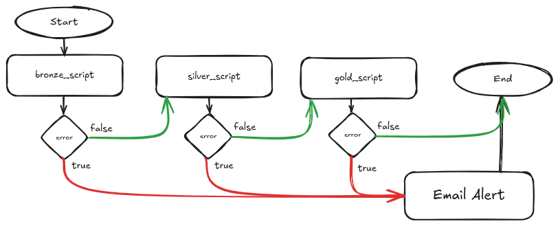
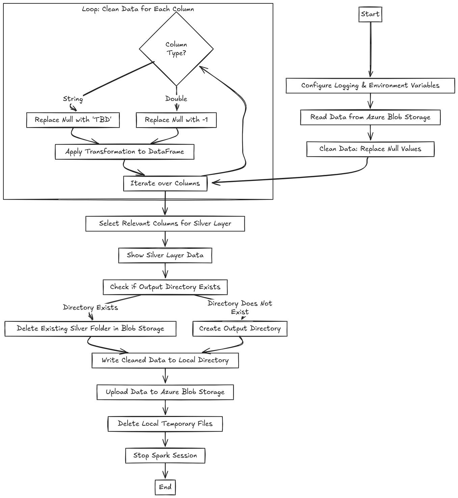
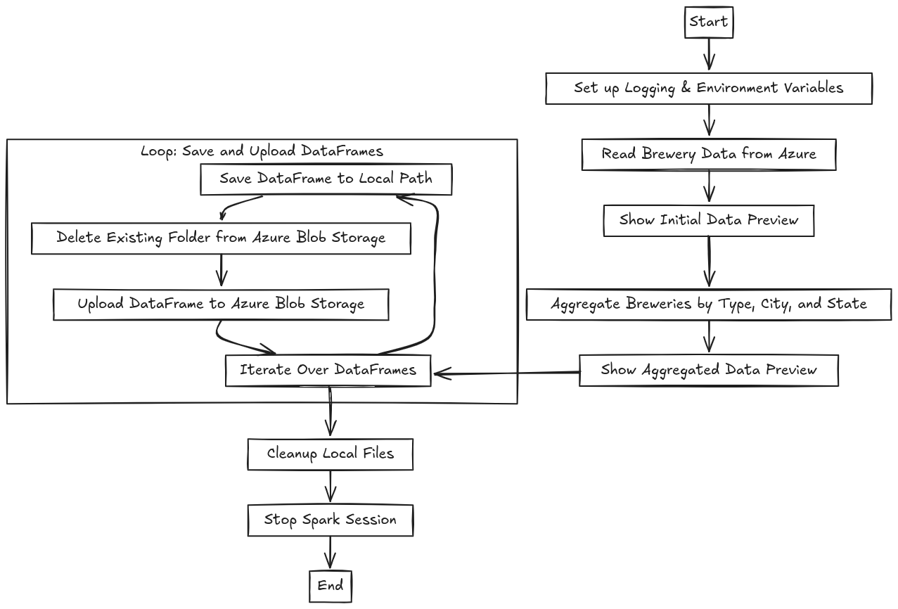
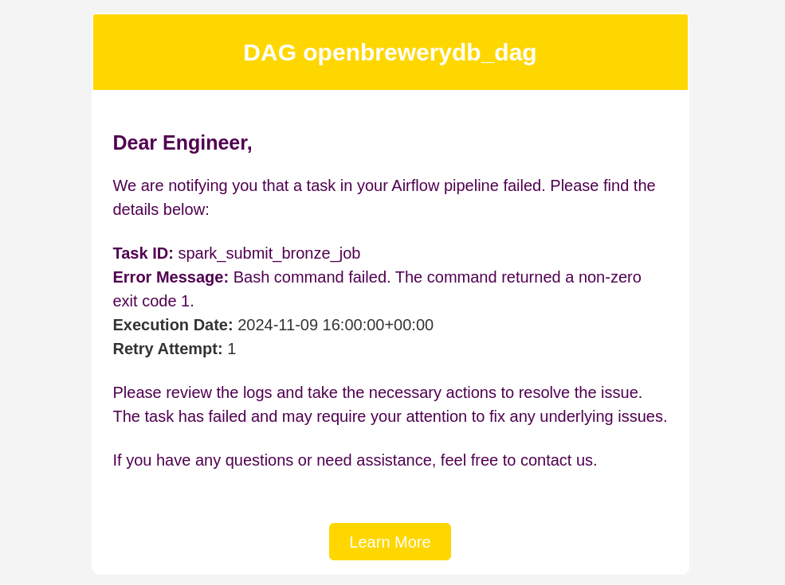

# BEES Data Engineering – Breweries Case
This data pipeline, built in **Docker**, retrieves brewery data from the **Open Brewery DB API**. It performs data ingestion and transformation using **Apache Spark** and applies the **medallion architecture**, storing the processed data in **Azure Blob Storage**. 
The entire process is orchestrated using **Apache Airflow** to ensure seamless automation and efficient workflow management.
The pipeline supports three stages of data processing: raw data is ingested into the **bronze layer**, transformed and refined in the **silver layer**, and aggregated and enriched in the **gold layer**.


## Project Structure
- **dags/**: Directory for Airflow DAGs.
- **dags/temp/**: Temporary directory used during the upload process.
- **dags/scripts/**: Directory for PySpark scripts.
- **dags/scripts/jars/**: Directory for Spark JAR files.

## Requirements
Before running the pipeline, ensure Docker and Docker Compose are installed. If not, follow the installation instructions:
- [Install Docker](https://docs.docker.com/get-docker/)
- [Install Docker Compose](https://docs.docker.com/compose/install/)

## Setup

### 1. Clone repository:
```
git clone https://github.com/brskyfolls/bees-breweries-data-engineering.git
```

### 2. Set Variables
These environment variables in **Dockerfile.airflow** are pre-configured to automatically send data to my Azure account and send error alerts to my email. Is recommended If you want to test with other account.
In **Dockerfile.airflow**, you can configure **Azure Blob Storage access credentials and specify containers** for each layer of the medallion architecture:
```
ENV CONTAINER_BRONZE= bronze_container \
    CONTAINER_SILVER=silver_container \
    CONTAINER_GOLD=gold_container \
    AZURE_ACCOUNT_NAME=account_name \
    AZURE_STORAGE_ACCOUNT_KEY=account_key

```

You can also set up **SMTP configurations for sending alert emails** and define the recipient email address:

```
ENV AIRFLOW__EMAIL__EMAIL_BACKEND=airflow.utils.email.send_email_smtp \
    AIRFLOW__SMTP__SMTP_HOST=smtp.gmail.com \
    AIRFLOW__SMTP__START_TLS=False \
    AIRFLOW__SMTP__SMTP_SSL=False \
    AIRFLOW__SMTP__SMTP_USER=sender_email \
    AIRFLOW__SMTP__SMTP_PASSWORD=password \
    AIRFLOW__SMTP__SMTP_PORT=587 \
    AIRFLOW__SMTP__SMTP_MAIL_FROM=sender_email\
    EMAIL_TO_SEND_ALERT=reciever_email
```

### 3. Docker Compose

```
docker-compose up --build -d
```

### 4. Set Permissions
Ensure the necessary permissions are set for the dags/ directory:

```
sudo chmod -R 7777 dags/* 
```

### 5. Airflow Web Interface

To navigate to the Airflow web interface, follow this link:

http://localhost:8080

Login with the credentials:
```
Username: airflow  
Password: airflow
```

### 6. Running Pipeline
#### Airflow Web Interface
You can trigger the pipeline directly from the Airflow Web Interface. Navigate to the DAG section:

http://localhost:8080/dags/openbrewerydb_dag/grid?tab=graph

Click the Play button in the top-right corner to start the DAG.




#### Running the Pipeline Manually
Alternatively, you can run the pipeline scripts manually by accessing the Docker container:
```
docker exec -it -u root bees-breweries-data-engineering-airflow-webserver-1 /bin/bash
```
Then, execute the following Spark job commands:
**Bronze Layer (Ingest Raw Data):**
```
spark-submit --master spark://spark-master:7077 \
  /opt/airflow/dags/scripts/bronze_layer.py
```

**Silver Layer (Transform Data):**
```
spark-submit --master spark://spark-master:7077 \
  --jars /opt/airflow/dags/scripts/jars/hadoop-azure-3.4.1.jar,/opt/airflow/dags/scripts/jars/azure-storage-8.6.6.jar,/opt/airflow/dags/scripts/jars/jetty-server-9.4.45.v20220203.jar,/opt/airflow/dags/scripts/jars/jetty-util-9.4.45.v20220203.jar,/opt/airflow/dags/scripts/jars/jetty-util-ajax-9.4.45.v20220203.jar \
  /opt/airflow/dags/scripts/silver_layer.py
```

**Gold Layer (Enrich and Aggregate Data):**
```
spark-submit --master spark://spark-master:7077 \
  --jars /opt/airflow/dags/scripts/jars/hadoop-azure-3.4.1.jar,/opt/airflow/dags/scripts/jars/azure-storage-8.6.6.jar,/opt/airflow/dags/scripts/jars/jetty-server-9.4.45.v20220203.jar,/opt/airflow/dags/scripts/jars/jetty-util-9.4.45.v20220203.jar,/opt/airflow/dags/scripts/jars/jetty-util-ajax-9.4.45.v20220203.jar \
  /opt/airflow/dags/scripts/gold_layer.py
```

## Pipeline Architecture

### DAG Workflow Overview
The pipeline follows a structured workflow orchestrated by Apache Airflow. Below is a high-level view of the Directed Acyclic Graph (DAG) for the brewery data pipeline:



This DAG is responsible for managing the execution of each stage in the data processing pipeline, from raw data ingestion through transformation to final aggregation.

### Detailed Task Flow
The DAG consists of several tasks that correspond to different stages of data processing. Here is a description of each stage:

#### **1. Bronze Layer - Ingest Raw Data**
- **Description:** 
This script fetches brewery data from the Open Brewery DB API, processes it, and uploads it to Azure Blob Storage in Parquet format. 
It uses Apache Spark for data processing and leverages Python functions to manage file operations and cloud interactions. 
The pipeline includes steps to fetch data with pagination, convert certain fields, define a schema for the data, write the processed data to a local directory, upload it to Azure Blob Storage, and clean up temporary files.
- **Task:** 
`bronze_layer.py`


#### **2. Silver Layer - Transform Data**
- **Description:** 
This script processes brewery data by cleaning null values, transforming it, and then uploading it to Azure Blob Storage in the Silver layer. 
It reads data from an Azure Blob container, cleans the data by replacing null values with default values based on the column type, and selects relevant columns for the Silver layer. 
The data is then written to the local filesystem, partitioned by brewery_type, and uploaded to Azure Blob Storage.
- **Task:** 
`silver_layer.py`



#### **3. Gold Layer - Enrich and Aggregate Data**
- **Description:** 
This script aggregates brewery data by type, city, and state from Azure Blob Storage, saves the aggregated results locally, uploads them to the Gold layer in Azure, and cleans up local files after the upload.
- **Task:** 
`gold_layer.py`



### DAG Task Dependencies
The tasks are defined in the following order of execution:

- **Bronze Layer** → **Silver Layer** → **Gold Layer**

Each task is dependent on the successful completion of the preceding task, ensuring the pipeline flows seamlessly from one stage to the next.

## Error Handling
In case of failure, the pipeline is configured to send email alerts with detailed error messages. The "Learn More" button in the email links directly to the Airflow DAG, providing quick access to error logs.


